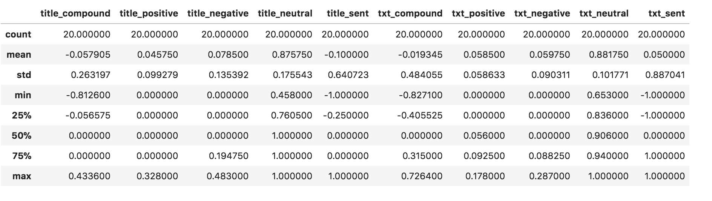
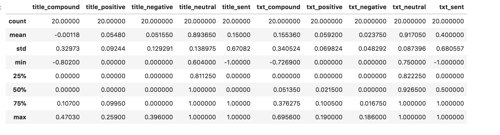
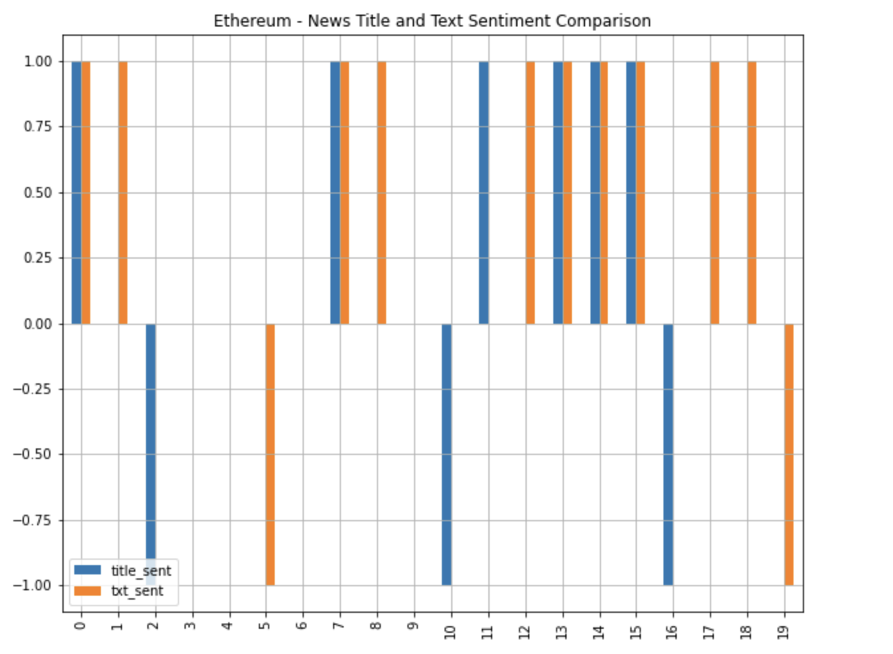
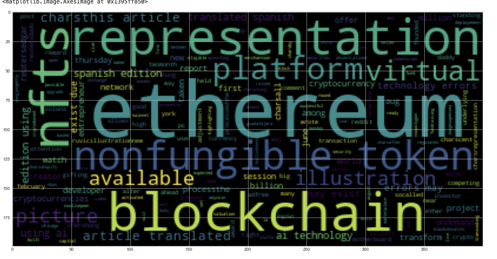
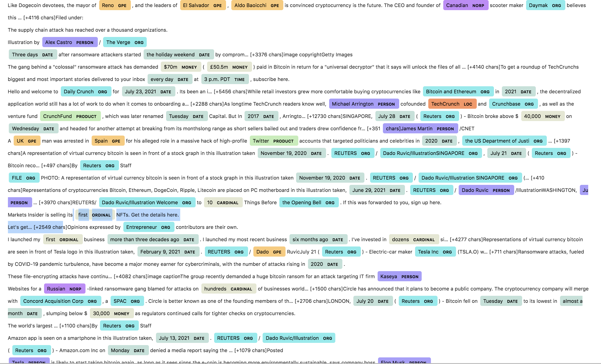
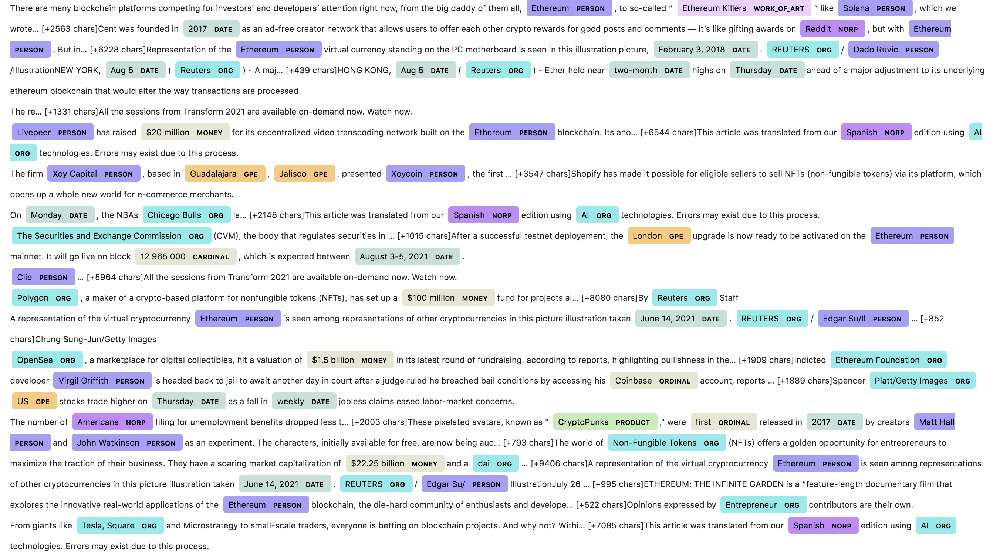

# **Tales from the Crypto**

---
### **Background**

There has been lot of excitement around cryptocurrencies and are extensively covered by News channels. It would a good idea to understand public sentiment against cryptocurrencies by analyzing news articles.

---
### **Objectives**
We  will apply natural language processing techniques to understand the sentiment in the latest news articles featuring Bitcoin and Ethereum. We will focus on 
* Sentiment Analysis
* Tokenization, Frequency analysis
* Named Entities Recognition

---
### **Steps**
*  **Sentiment Analysis**
1.  Using the [newsapi](https://newsapi.org/) to pull the latest news articles for Bitcoin and Ethereum and load the data into Pandas Dataframe
2. Using SentimentIntensityAnalyzer from nltk.sentiment.vader, calculate compound score, positive, neutral and negative score for each of articles
3. Analyze the sentiment scores.

* **Natural Language Processing**
1. Initialize WordNetLemmatizer from nltk.tokenize  and english language stop words. Add any additional stop words if necessary
2. Create a function to tokenize the articles after preprocessing news articles.
3. Using nltk create ngrams with n=2 (bigrams) and conduct frequency analysis
4. Generate word clouds for each coin to summarize the news for each coin

* **Named Entity Recognition (NER)**
1. Using spacy build NER for both coins and visualize the results

---
### **Technologies/Tools/Libraries**
1. Python
2. Pandas
3. nltk
4. Newsapi
5. re
6. nltk.sentiment.vader
7. Matplotlib
8. nltk.tokenize
9. nltk.corpus
10. nltk.stem
11. Collections
12. nltk ngrams
13. wordcloud
14. spacy
15. Jupyter Notebook
16. os

---
### **Data**
Data from [newsapi](https://newsapi.org/) is used to pull the latest news articles for Bitcoin and Ethereum.

---
### **Code**
*   [Crypto sentiment](crypto_sentiment.ipynb)

---
### **Output**

* Sentiment Scores
  

  

  

  

* Word Cloud
  

  

* NER
  

  